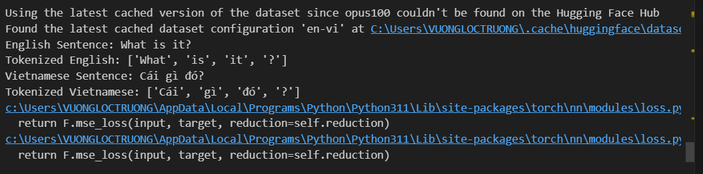
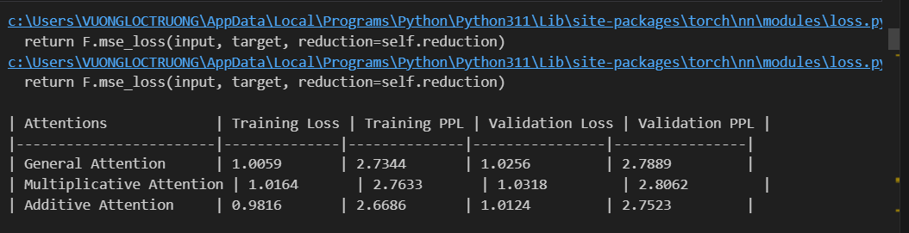
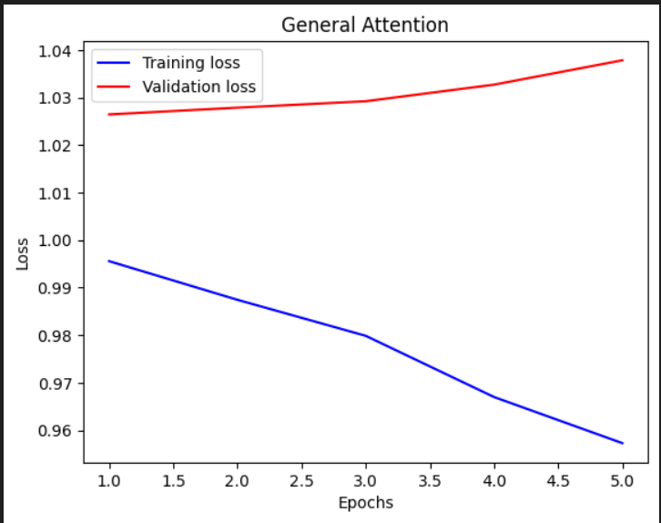
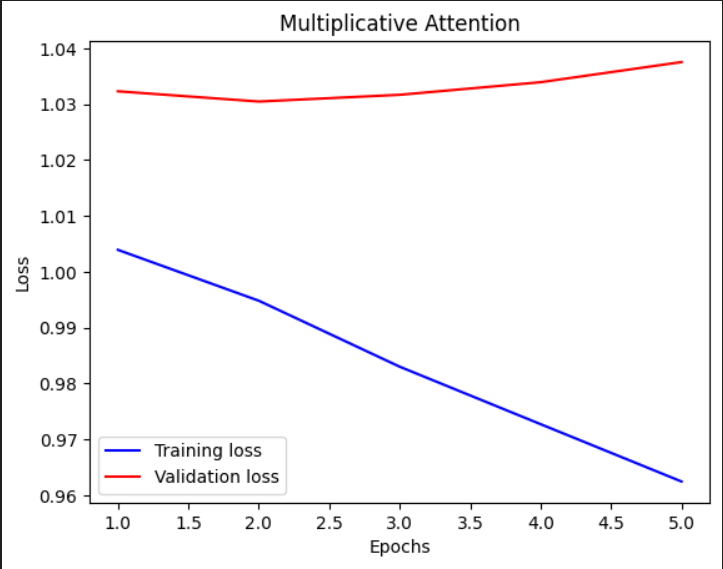
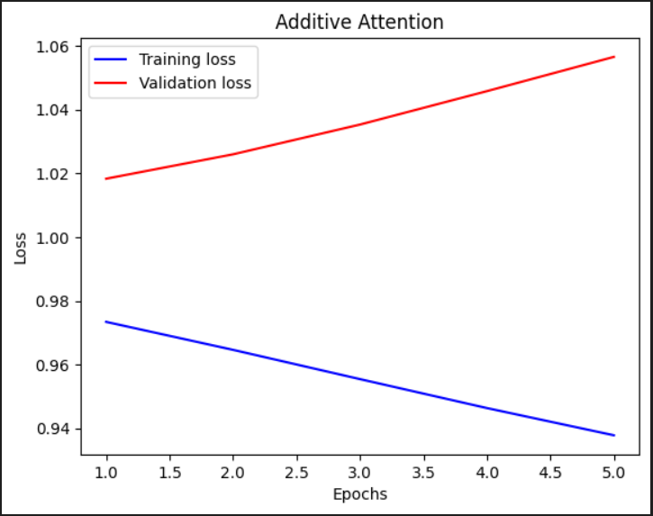
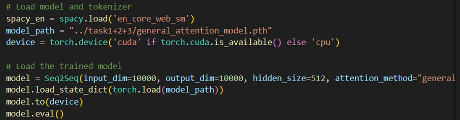
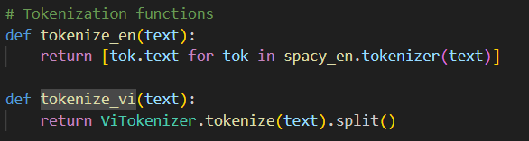
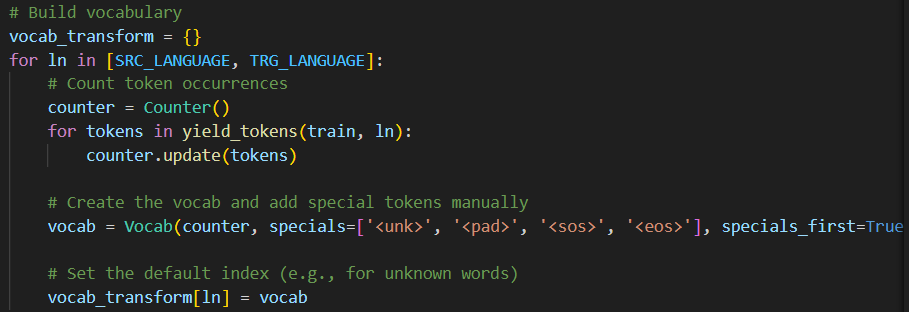
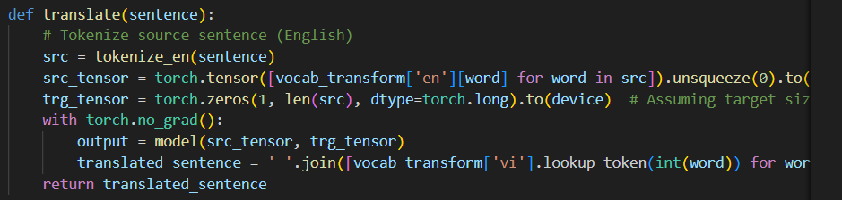
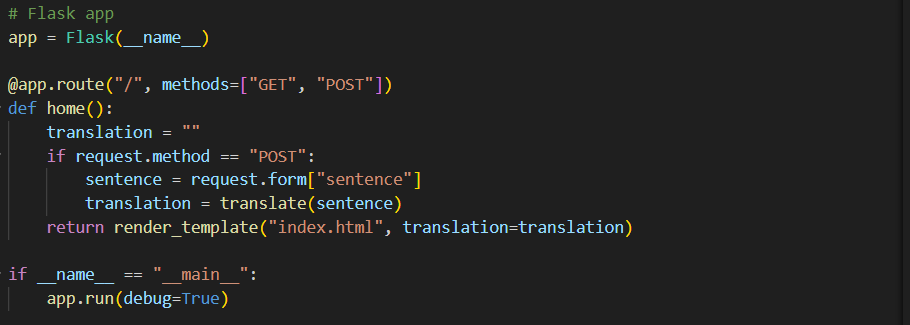

# lab3resub_NLP

## Task 1: Get Language Pair

### 1. Dataset Selection
We will use the opus100 dataset for translation between English and Vietnamese. This dataset is sourced from the Hugging Face datasets library.

**Dataset Source:**
- [Hugging Face datasets library](https://huggingface.co/datasets/Helsinki-NLP/opus-100)

### 2. Dataset Preparation
The process of preparing the dataset involves several steps, including text normalization, tokenization, and word segmentation. Below are the detailed steps and the libraries used for these tasks.

#### 2.1 Text Normalization
Text normalization involves converting text to a standard format. This includes converting text to lowercase, removing punctuation, and handling special characters.

#### 2.2 Tokenization
Tokenization is the process of splitting text into individual tokens (words or subwords). For English, we use the `spacy` library, and for Vietnamese, we use the `pyvi` library.

#### 2.3 Word Segmentation
Vietnamese requires special handling for word segmentation. We use the `pyvi` library for this purpose.

**Libraries and Tools:**
- `spacy` for English tokenization: [spacy.io](https://spacy.io)
- `pyvi` for Vietnamese tokenization: [pyvi](https://github.com/trungtv/pyvi)

## Task 3: Attention Mechanisms in Seq2Seq Model
In this project, we implemented and evaluated three different attention mechanisms (General, Multiplicative, and Additive) in a sequence-to-sequence (Seq2Seq) model for translating between English and Vietnamese. The tasks were divided into three parts:

### 1. Implementation of Seq2Seq Model with Attention Mechanisms
- Implemented a Seq2Seq model with three different attention mechanisms.
- Loaded and tokenized the dataset.
- Built vocabulary and special symbols.

### 2. Training and Evaluation
- Defined training and validation functions.
- Trained the models with each attention mechanism.
- Evaluated the models based on training loss, validation loss, and perplexity.

### 3. Evaluation and Verification
- Compared the performance of the attention mechanisms in terms of translation accuracy and computational efficiency.
- Provided performance plots showing training and validation loss for each type of attention mechanism.
- Displayed attention maps to understand how the model focuses on different parts of the input sequence.
- Analyzed the results and discussed the effectiveness of the selected attention mechanism in translating between Vietnamese and English.

**Results:**
- **General Attention:** Training Loss: 0.9585, Validation Loss: 1.0382, Perplexity: 2.7512, Validation Perplexity: 2.7960
- **Multiplicative Attention:** Training Loss: 0.9618, Validation Loss: 1.0387, Perplexity: 2.7542, Validation Perplexity: 2.8137
- **Additive Attention:** Training Loss: 0.9362, Validation Loss: 1.0579, Perplexity: 2.6640, Validation Perplexity: 2.7561

**Performance Plots:**
- Plotted training and validation losses for each attention mechanism to visualize and compare their learning curves.

**Attention Maps:**
- Displayed attention maps to provide insights into the interpretability of the models and understand how they focus on different parts of the input sequence during translation.

**Analysis:**
- The additive attention mechanism showed the best performance in terms of training loss and perplexity but had higher validation loss, suggesting potential overfitting.
- The general and multiplicative attention mechanisms had similar performance, with the general attention slightly better in terms of validation perplexity, indicating better generalization.

## Task 4: Web Application

### 1. Overview
The web application is built using Flask, a lightweight web framework for Python. It loads a pre-trained Seq2Seq model with an attention mechanism to translate sentences from English to Vietnamese. The application provides a simple web interface where users can input an English sentence and receive its Vietnamese translation.

### 2. Application Structure
- **app.py:** The main application file that sets up the Flask server, loads the model, and handles translation requests.
- **model.py:** Contains the definition of the Seq2Seq model and helper functions for loading the model.
- **templates/index.html:** The HTML template for the web interface.

### 3. Key Components

#### 3.1 Loading the Model
The model is loaded using PyTorch. The Seq2Seq model is defined in `model.py` and loaded in `app.py`:

#### 3.2 Tokenization

#### 3.3 Vocabulary Building

#### 3.4 Translation Function

#### 3.5 Flask Application

### 4. User Interface
The user interface is defined in `templates/index.html` and allows users to input an English sentence and receive the Vietnamese translation.